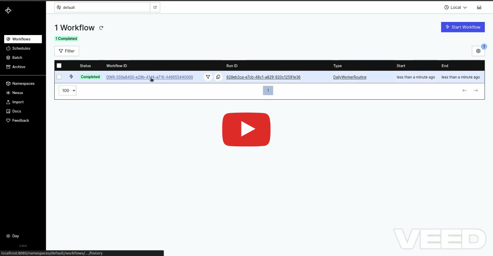

# Deploying XFieldOps on a Kind Cluster Using Helm

This guide walks you through creating a local [Kind](https://kind.sigs.k8s.io/) cluster, deploying [Temporal](https://temporal.io/) using [Helm](https://helm.sh/), and customizing it via `values.yaml`.

## Table of Contents

1. [Prerequisites](#prerequisites)
2. [Create Kind Cluster](#create-kind-cluster)
3. [Install Temporal on Kind](#install-temporal-on-kind)
4. [Build Docker Images ](#build-docker-images)
5. [Deploying API Server and Worker](#deploying-api-server-and-worker)
6. [Running Integration tests](#running-integration-tests)
---

## Prerequisites

Make sure you have the following tools installed:

- **Docker**: Required to create and run local containers.
- **Kind**: A tool for running local Kubernetes clusters using Docker container “nodes”.
- **Helm**: A package manager for Kubernetes.
- **K9s**: A terminal based UI to interact with your Kubernetes clusters

You can verify that they are installed using:

```bash
docker version
kind version
helm version
k9s version
```
## Create Kind Cluster

1. Install Kind if you haven’t already. Refer to the Kind installation guide.
2. Create a new Kind cluster:
```
kind create cluster --name temporal-cluster
```
This command provisions a single-node Kind Kubernetes cluster named temporal-cluster.
3. Confirm that your Kind cluster is running:
```
kubectl cluster-info --context kind-temporal-cluster
```

## Install Temporal on Kind 

To install Temporal in a limited but working and self-contained configuration (one replica of Cassandra, Elasticsearch and each of Temporal's services, no metrics), you can run:

```
helm install \
    --repo https://go.temporal.io/helm-charts \
    --set server.replicaCount=1 \
    --set cassandra.config.cluster_size=1 \
    --set elasticsearch.replicas=1 \
    --set prometheus.enabled=false \
    --set grafana.enabled=false \
    temporal temporal \
    --timeout 15m -n temporal --create-namespace
```
This configuration consumes limited resources and it is useful for small scale tests (such as using kind or minikube).

Below is an example of an environment installed in this configuration:

```
$ kubectl get pods -n temporal -w
NAME                                       READY   STATUS    RESTARTS   AGE
temporal-admintools-6cdf56b869-xdxz2       1/1     Running   0          11m
elasticsearch-master-0                     1/1     Running   0          11m
temporal-cassandra-0                       1/1     Running   0          11m
temporal-frontend-5d5b6d9c59-v9g5j         1/1     Running   2          11m
temporal-history-64b9ddbc4b-bwk6j          1/1     Running   2          11m
temporal-matching-c8887ddc4-jnzg2          1/1     Running   2          11m
temporal-metrics-server-7fbbf65cff-rp2ks   1/1     Running   0          11m
temporal-web-77f68bff76-ndkzf              1/1     Running   0          11m
temporal-worker-7c9d68f4cf-8tzfw           1/1     Running   2          11m
```

## Build Docker Images
1. Build your Docker image(s):
```
docker build -f Dockerfile.worker -t xfieldops/worker .

docker build -f Dockerfile.server -t xfieldops/server .
```

2. Load the image into the Kind cluster
```
kind load docker-image xfieldops/worker --name temporal-cluster

kind load docker-image xfieldops/server --name temporal-cluster
```
OR
Push them to a Docker registry
```
docker push xfieldops/worker
docker push xfieldops/server
```

### Deploying API Server and Worker

1. Update the ```values.yaml``` file according to your configuration
2. cd to ```reference-app-wms-go/helm/``` and run:
```
helm install xfieldops .
```
3. Wait for the pods to get in ready state 
```
NAME                                          READY   STATUS      RESTARTS        AGE
reference-app-wms-api-dbd4c85fb-76k6z         1/1     Running     2 (11m ago)     13m
reference-app-wms-db-init-zb5ns               0/1     Completed   0               13m
reference-app-wms-postgres-7cc5b5cf9f-zzdnv   1/1     Running     0               13m
reference-app-wms-worker-7858d75f74-xb7sq     1/1     Running     6 (8m43s ago)   13m
```
Note: Make sure your temporal cluster has default namespace.

### Running Integration tests

1. Run k9s on one of your terminal using:
``
$ k9s
``
then press 0 to list all pods

2. Port forward your API Server, Postgres DB, Temporal frontend and Temporal web.
3 If you port forwarded temporal web on 8080. Open localhost:8080 on your browser to access temporal UI.
4. Update the values below in ```test/integration/test_utils.go``` with your DB credentials and port forwarded ports

```
const (
	testDBName = "wms_db"
	testDBHost = "localhost"
	testDBPort = "5432"
	testDBUser = "wms_user"
	serverPort = 8081
)
```
5. Run any integration test locally from your PC


## Video Guide


[](https://youtu.be/m5ocyT_NtOs)
## Troubleshooting

1- If Worker logs shows that no default namespace exist you would need to exec in Temporal admin tools pod then tctl namespace register default to fix it.

2- If activity logs show header issues make sure that the correct ports and FQDN is used by the temporal worker
